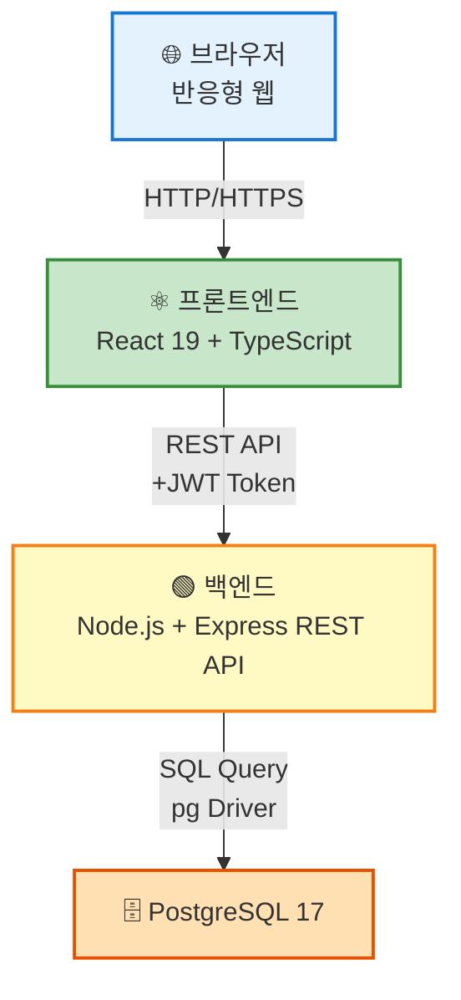
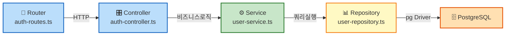
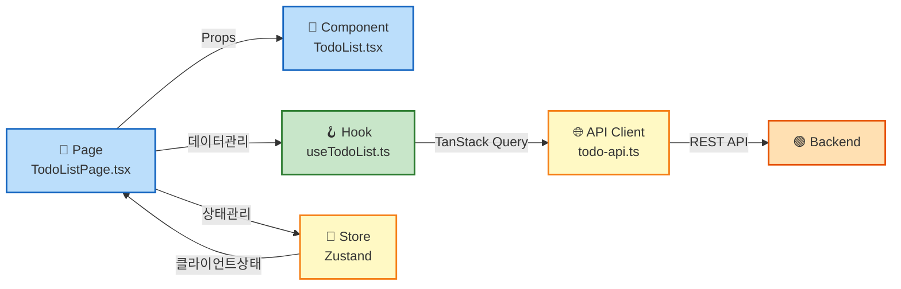

# TodoListApp 기술 아키텍처 다이어그램

**버전:** 1.0.0
**작성일:** 2026-05-13
**참조:** docs/2-prd.md, docs/4-project-structure-principles.md

---

## 1. 시스템 전체 구조

시스템은 반응형 웹 UI(프론트엔드), REST API 백엔드, PostgreSQL 데이터베이스로 구성되며, JWT 인증으로 보호됩니다.

---

## 2. 백엔드 레이어 구조

요청은 Router → Controller → Service → Repository 순서로 흐르며, Repository는 pg를 통해 직접 SQL을 실행합니다.

---

## 3. 프론트엔드 레이어 구조

Page는 Component, Hook, Store를 조합하여 화면을 구성하며, Hook은 TanStack Query로 서버 상태를 관리하고 API Client를 통해 백엔드와 통신합니다.
