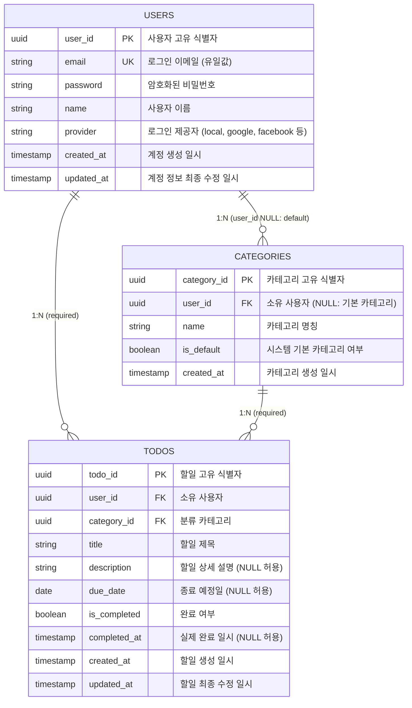

# TodoListApp ERD

**버전:** 1.0.0  
**작성일:** 2026-05-13  
**참조:** docs/2-prd.md (섹션 6. 데이터 모델), docs/1-domain-definition.md

---

## ERD

---

## 관계 설명

| 엔티티 | 관계 유형 | 대상 엔티티 | 조건 | 설명 |
|---|---|---|---|---|
| USERS | 1:N | CATEGORIES | user_id NULL 허용 | 한 사용자는 여러 카테고리를 소유 (NULL은 기본 카테고리) |
| USERS | 1:N | TODOS | user_id NOT NULL | 한 사용자는 여러 할일을 소유 |
| CATEGORIES | 1:N | TODOS | category_id NOT NULL | 한 카테고리에 여러 할일이 속함 |

---

## 주요 설계 결정

### 1. 사용자 (USERS)

- **provider 컬럼**: OAuth 소셜 로그인 확장을 고려하여 1차부터 포함. 초기값 'local'(로컬 인증)
- **email 유니크 제약**: 중복 가입 방지, 로그인 ID 역할
- **암호화 저장**: 비밀번호는 평문 저장 불가, bcrypt(salt rounds ≥ 10) 필수

### 2. 카테고리 (CATEGORIES)

- **user_id NULL 허용**: 시스템 기본 카테고리(`업무`, `개인`, `쇼핑`)는 user_id = NULL로 저장
  - 모든 사용자가 조회 가능
  - 수정/삭제 불가 (is_default = true로 제어)
- **is_default 플래그**: 기본 카테고리 여부 표시 (향후 UI에서 수정 제약 처리)
- **사용자 정의 카테고리**: user_id가 해당 사용자 ID인 경우, 소유자만 관리 가능

### 3. 할일 (TODOS)

- **완료 처리**: is_completed 토글 시
  - true → completed_at에 현재 시각 기록
  - false → completed_at = NULL로 초기화
- **기한 초과 판정**: due_date < 오늘 날짜 AND is_completed = false일 때 'overdue' 상태 (계산 속성, DB 저장 안 함)
- **카테고리 삭제 시 재분류**: 기본 카테고리(`개인`, user_id = NULL) ID로 자동 UPDATE

### 4. 데이터 보존 정책

- **회원 탈퇴 시**: CASCADE DELETE
  - 사용자 삭제 → 해당 사용자의 모든 할일 및 사용자 정의 카테고리 즉시 삭제
  - 기본 카테고리(user_id = NULL)는 유지

### 5. 타임스탬프

- **created_at**: 데이터 생성 일시 (DEFAULT now())
- **updated_at**: 데이터 최종 수정 일시 (DEFAULT now(), UPDATE 시 갱신)
- **completed_at**: 할일 완료 일시 (NULL 가능, 완료 시에만 기록)

---

## ERD 컬럼 타입 정의

| 타입 | 설명 | 예시 |
|---|---|---|
| uuid | UUID 고유 식별자 | 550e8400-e29b-41d4-a716-446655440000 |
| string | 문자열 (VARCHAR) | 'user@example.com' |
| timestamp | 타임스탬프 (TIMESTAMPTZ) | 2026-05-13 10:30:45+09:00 |
| date | 날짜 (DATE) | 2026-05-20 |
| boolean | 불린 값 | true / false |

---

## 제약 조건 요약

### 기본 키 (Primary Key)
- USERS.user_id
- CATEGORIES.category_id
- TODOS.todo_id

### 외래 키 (Foreign Key)
- CATEGORIES.user_id → USERS.user_id (NULL 허용)
- TODOS.user_id → USERS.user_id (NOT NULL)
- TODOS.category_id → CATEGORIES.category_id (NOT NULL)

### 유니크 제약 (Unique Constraint)
- USERS.email (시스템 전체 유일)

### 기본값 (Default)
- USERS.provider = 'local'
- CATEGORIES.is_default = false
- TODOS.is_completed = false

---

## 다음 단계

1. **마이그레이션 스크립트**: SQL DDL 작성 (docs/7-migration.md 또는 백엔드 리포지토리)
2. **인덱스 전략**: 조회 성능 최적화 인덱스 정의
   - USERS.email (유니크 인덱스, 로그인 성능)
   - TODOS.user_id, category_id (사용자별/카테고리별 조회)
   - TODOS.due_date (기한 초과 필터링)
3. **쿼리 예시**: 주요 API별 SELECT/INSERT/UPDATE 패턴 문서화
