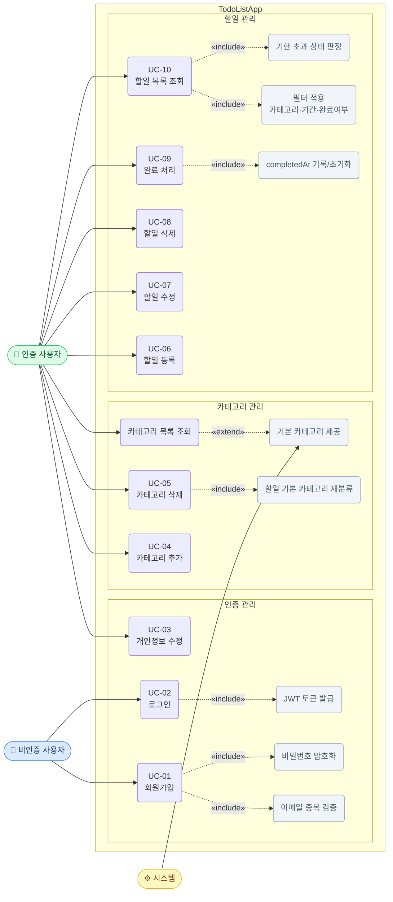

# TodoListApp Use Case Diagram

**버전:** 1.0.0
**작성일:** 2026-05-13
**참조:** docs/1-domain-definition.md, docs/2-prd.md

---

## 전체 유스케이스 다이어그램

---

## 유스케이스 목록 요약

| UC-ID | 유스케이스 | 주체 | 관계 |
|---|---|---|---|
| UC-01 | 회원가입 | 비인증 사용자 | «include» 이메일 중복 검증, 비밀번호 암호화 |
| UC-02 | 로그인 | 비인증 사용자 | «include» JWT 토큰 발급 |
| UC-03 | 개인정보 수정 | 인증 사용자 | — |
| UC-04 | 카테고리 추가 | 인증 사용자 | — |
| UC-05 | 카테고리 삭제 | 인증 사용자 | «include» 할일 기본 카테고리 재분류 |
| UC-06 | 할일 등록 | 인증 사용자 | — |
| UC-07 | 할일 수정 | 인증 사용자 | — |
| UC-08 | 할일 삭제 | 인증 사용자 | — |
| UC-09 | 할일 완료 처리 | 인증 사용자 | «include» completedAt 기록/초기화 |
| UC-10 | 할일 목록 조회 | 인증 사용자 | «include» 필터 적용, 기한 초과 상태 판정 |
| — | 기본 카테고리 제공 | 시스템 | «extend» 카테고리 목록 조회 |

---

## 관계 범례

| 표기 | 의미 |
|---|---|
| `실선 →` | 액터가 유스케이스를 직접 실행 |
| `«include»` | 유스케이스 실행 시 반드시 포함되는 하위 동작 |
| `«extend»` | 특정 조건에서 선택적으로 추가되는 동작 |
